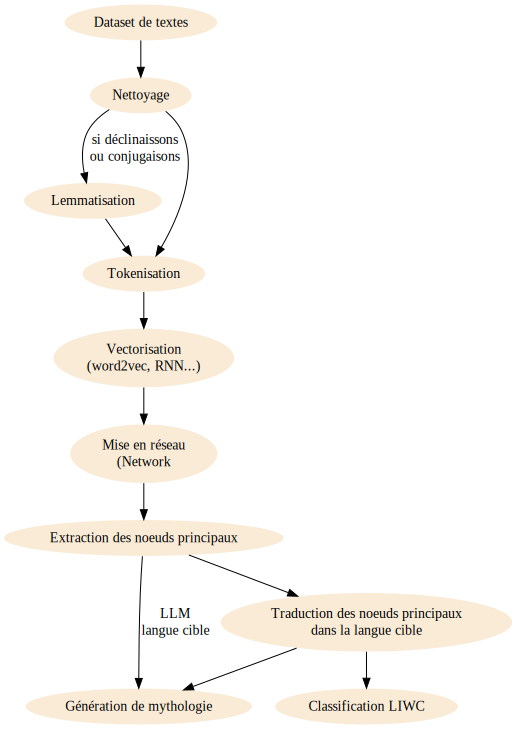

# Civilisation hacking

La Grèce antique est une civilisation fondatrice pour l'humanité, particulièrement pour l'Occident.  Mais cette période, la Grèce classique, durant laquelle furent inventés et transcendés tant de sciences, de philosophies, d'arts, ne dure finalement que de la victoire sur les Perses à Salamine à la mort d'Alexandre le Grand, soit 157 ans. Les merveilles dont nous parlons encore furent les actes de quelques dizaines de milliers d'hommes, 30000 à l'apogée d'Athènes.
La quantité ne fait pas la qualité. Mais il est quand même incroyable de penser que si peu d'hommes pendant si peu de temps ont à ce point été disruptifs, tout en se réclamant de la tradition.
Ce qui nous reste, c'est peu de choses: quelques œuvres d'art cassées, des fragments de textes plus ou oins bien recopiés, parfois par des intégristes chrétiens ou musulmans qui avaient leur censure et leur sélectivité.
Le XIXe siècle fut un grand siècle d'archéologie parfois menée à la pioche puis à la dynamite. Il en va de même des textes et des dictionnaires, monuments érigés à la lumière de la bougie, mais aussi projections de l'âme de leur époque sur celle de l'antiquité.

# Traduction trahison

Pour comprendre le problème, imaginons que je ne connaisse rien à l'anglais et que je veuille traduire en français l'expression "artificial intelligence". Je vais bien sûr regarder dans le dictionnaire. Un dictionnaire, c'est une table de correspondance entre un mot dans une langue et, le plus souvent, un ensemble de mots ou de périphrases qui veulent rendre le même sens dans une nouvelle langue. Pour ce faire, les concepteurs de dictionnaires lisent les textes, en développent une compréhension puis ils proposent que tel mot soit traduit en tels autres mots possibles, généralement classés du plus probable au moins probable.

Si je cherche "intelligence" dans le dictionnaire, je vais trouver en anglais:

- La capacité à apprendre
- L'information, le renseignement, comme dans CIA

Mais en français le mot intelligence, qui est d'origine française en fait, ne veut pas dire exactement la même chose:
- La capacité de réflexion
- Ententes et communications secrètes (la fameuse intelligence avec l'ennemi)
- La capacité d'adaptation

Pareil pour "artificial" - l'anglais est quand même essentiellement du français déformé - qui veut dire en français "produit par l'activité humaine", "qui manque de simplicité" ou "qui relève d'un procédé", mais qui en anglais signifie "produit par la volonté de quelqu'un", "non sincère" ou "basé sur des caractéristiques superficielles"

Les sens ne se recouvrent pas tout à fait. Je peux bien sûr choisir de traduire artificial intelligence par intelligence artificielle, mais en réalité si je traduis par procédé de renseignement, je serais pratiquement plus proche de ce que cela signifie dans la plupart des cas.

## Ce que cela signifie dans le cas du grec ancien

L'anglais a hérité de près de la moitié de son vocabulaire du français et ce sont des langues qui existent à la même époque. Dans le cas du grec ancien, nous avons des textes, mais plus aucune idée de l'état d'esprit des hommes qui les écrivirent. Cela se traduit par des traductions variées, et parfois franchement hypothétiques, de textes de références. Quand il s'agit de philosophie, c'est ennuyeux, voire catastrophique. Mais les textes épiques eux-mêmes, tels que l'Odyssée d'Homère, étaient faits pour être beaux, pour bien sonner. Leurs traductions sont parfois pataudes et si on comprend bien l'histoire d'Ulysse, on ne peut rien savoir de l'effet qu'elle produisait sur ceux qui l'écoutaient. Selon l'adage de traducteur : telles les femmes sont les traductions: quand elles sont belles, elles ne sont pas fidèles et quand elles sont fidèles, elles ne sont pas belles.

## L'état d'esprit d'une civilisation

Ce qui fait la différence entre une entreprise qui réussit sur un marché et une autre, sur le même marché, qui fera quant à elle faillite, c'est certes le talent, mais aussi l'état d'esprit et les valeurs des gens qui y travaillent. Il est tout à fait remarquable que cet avoir clef soit absent des bilans comptables. Certes, ce n'est pas facile à mesurer.

Dans ce projet, j'ai voulu essayer de répondre - ou pour le moins proposer une méthode pour ce faire - à la question "qu'est-ce qu'ils avaient de plus que nous?"

Pour cela nous allons utiliser une architecture d'intelligence artificielle et une référence basée sur les textes.

# Archéologie littéraire

## Le filet d'Indra

Indra est un dieu védique qui possède un filet tout à fait exceptionnel. D'abord il est infini et, en plus, sur chacun de ces nœuds il y a une perle de cristal parfaitement réfléchissante. Ces perles sont tellement parfaites que si on en regarde une, on peut voir le reflet de toutes les autres. Voici une allégorie de ce que nous allons faire, c'est-à-dire un autoencodeur(Řehůřek,2010).

## Procédé

Il va s'agir de prendre une grande quantité de textes grecs issus du projet opengreekandlatin (Muellner,1019), qui représente environ 1000 ans de reliques textuelles patiemment structurées par des gens remarquablement patients.

1. Dans un premier temps, nous allons détecter toutes les phrases qui sont en grec, car il y a aussi des commentaires en anglais, des références. Cela fera environ 150000 phrases de plus de 7 mots.
2. Ensuite, le grec est une langue assez complexe qui a des déclinaisons et des conjugaisons. Comme nous nous intéressons au sens des mots, nous allons "lemmatiser" les textes, ce qui veut dire ramener les mots à une racine commune. En français, cela reviendrait à convertir "je vais" en "je aller". En grec aussi, il ne suffit pas d'enlever la terminaison des mots pour en trouver la racine. Le procédé n'est pas totalement fiable, mais 84,7% des mots ont pu être lemmatisés. En réalisant cela, nous perdons de l'information, car les déclinaisons renseignent fortement sur le sens. Nous allons seulement étudier le sens racine des mots qui seront contenus dans une "fenêtre" de huit mots. Par ailleurs, il aurait été possible de prendre en compte des expressions de deux ou trois mots. Mais dans cette expérience, ce sera le mot qui sera la perle de notre filet d'Indra.
3. Ensuite, nous allons entraîner le modèle de langage afin qu'il soit capable de transformer un mot en une coordonnée dans un espace à 300 dimensions.

Nous obtenons donc un modèle qui ne fait appel à aucun dictionnaire, mais qui établit les relations entre les mots sous forme d'opérations vectorielles. Si cet espace à 300 dimensions en avait 2, ce serait une carte. De la même manière, il va donc être possible de trouver les voisins d'un mot, de mesurer des distances entre les mots, et de faire des voyages.

# Utiliser la carte du grec ancien

## Le voisinage

Si chaque mot à une position sur la carte, il a aussi des voisins. βασιλεύς (basileus, le roi) est voisin de paix (ειρηνη), royal (βασιλειος), peuple (λαος)
La carte permet de trouver des sens en relation sans traduire.

## La table des distances

Sur une carte, le géomètre peut mesurer des distances. Ici, plus le chiffre est proche de 1 plus les mots sont proches dans l'hyperespace.

<small>Tab.1: Table de distances</small>

| | πόνος (travail dur)   | γυνή (femme) | ἀνήρ (homme) | βασιλεύς (roi)| δοῦλος (esclave) | αἴλουρος (chat)|
|----------|------|------|----------|--------|----------|
| πόνος    | 1.00 | 0.54 | 0.88     | 0.62   | 0.88     | 0.88 |
| γυνή     | 0.54 | 1.00 | 0.59     | 0.73   | 0.77     | 0.49 |
| ἀνήρ     | 0.88 | 0.59 | 1.00     | 0.53   | 0.88     | 0.82 |
| βασιλεύς | 0.62 | 0.73 | 0.53     | 1.00   | 0.78     | 0.43 |
| δοῦλος   | 0.88 | 0.77 | 0.88     | 0.78   | 1.00     | 0.79 |
| αἴλουρος | 0.88 | 0.49 | 0.82     | 0.43   | 0.79     | 1.00 |

Ainsi la distance entre les sens que recouvre chacun des mots peut renseigner sur la façon dont les grecs les positionnaient.

## Les voyages

Sur une carte, il est possible d'aller d'un point à un autre par translation. Les vecteurs s'ajoutent et se retranchent, ainsi 

βασιλεύς(roi) + γυνή (femme) - ἀνήρ (homme) = βασιλισσα (reine)

Cette addition fonctionne particulièrement bien avec des grands modèles (ici un modèle basé sur Perseus) (Wishart, 2023). Avec le modèle précédemment basé sur opengreekandlatin, cette opération donne παις (fille) ou οικος (à la maison), ce qui est plausible dans une société partriacale mais moins dans l'air du temps.

# Un filet de significations

Puisque nous disposons d'un modèle de la langue grecque, il est possible de représenter un réseau de connexions entre chaque mot et ses plus proches voisins.

@@IFRdata:text/html;base64,//4KACAAIAAgACAAPABoAGUAYQBkAD4ACgAgACAAIAAgADwAcwBjAHIAaQBwAHQAIABzAHIAYwA9ACIAaAB0AHQAcABzADoALwAvAHYAaQBzAGoAcwAuAGcAaQB0AGgAdQBiAC4AaQBvAC8AdgBpAHMALQBuAGUAdAB3AG8AcgBrAC8AcwB0AGEAbgBkAGEAbABvAG4AZQAvAHUAbQBkAC8AdgBpAHMALQBuAGUAdAB3AG8AcgBrAC4AbQBpAG4ALgBqAHMAIgA+ADwALwBzAGMAcgBpAHAAdAA+AAoACgAgACAAIAAgACAAPABzAGMAcgBpAHAAdAAgAHQAeQBwAGUAPQAiAHQAZQB4AHQALwBqAGEAdgBhAHMAYwByAGkAcAB0ACIAPgAKACAAIAAgACAAIAAgACAAIAAgACAAdgBhAHIAIABuAG8AZABlAHMALAAgAGUAZABnAGUAcwAsACAAbgBlAHQAdwBvAHIAawA7AAoACgAKAAoAIAAgACAAIAAgACAAIAAgACAAZgB1AG4AYwB0AGkAbwBuACAAZAByAGEAdwAoACkAIAB7AAoAIAAgACAAIAAgACAAIAAgACAAIAAgACAALwAvACAAYwByAGUAYQB0AGUAIABhAG4AIABhAHIAcgBhAHkAIAB3AGkAdABoACAAbgBvAGQAZQBzAAoAIAAgACAAIAAgACAAIAAgACAAIAAgACAAbgBvAGQAZQBzACAAPQAgAG4AZQB3ACAAdgBpAHMALgBEAGEAdABhAFMAZQB0ACgAKQA7AAoACgAgACAAIAAgACAAIAAgACAAIAAgACAAIABuAG8AZABlAHMALgBhAGQAZAAoAFsAewBpAGQAOgAiAE4AMAAiACwAIABsAGEAYgBlAGwAOgAiALIDsQPDA7kDuwO1A80DwgMiACwAIABjAG8AbABvAHIAOgAiACMARgBBAEUAQgBEADcAIgAsACAAYgBvAHIAZABlAHIAVwBpAGQAdABoADoAIAAiADAAIgB9ACwAewBpAGQAOgAiAE4AMQAiACwAIABsAGEAYgBlAGwAOgAiALMDtQO9A7UDxAPGH8EDsQMiACwAIABjAG8AbABvAHIAOgAiACMAYwBjAGUANgBmAGYAIgAsACAAYgBvAHIAZABlAHIAVwBpAGQAdABoADoAIAAiADAAIgB9ACwAewBpAGQAOgAiAE4AMgAiACwAIABsAGEAYgBlAGwAOgAiALIDsQPDA68DuwO1A7kDvwO9AyIALAAgAGMAbwBsAG8AcgA6ACIAIwBjAGMAZQA2AGYAZgAiACwAIABiAG8AcgBkAGUAcgBXAGkAZAB0AGgAOgAgACIAMAAiAH0ALAB7AGkAZAA6ACIATgAzACIALAAgAGwAYQBiAGUAbAA6ACIAvQOxA8wDwgMiACwAIABjAG8AbABvAHIAOgAiACMAYwBjAGUANgBmAGYAIgAsACAAYgBvAHIAZABlAHIAVwBpAGQAdABoADoAIAAiADAAIgB9ACwAewBpAGQAOgAiAE4ANAAiACwAIABsAGEAYgBlAGwAOgAiALgDwQPMA70DvwPCAyIALAAgAGMAbwBsAG8AcgA6ACIAIwBjAGMAZQA2AGYAZgAiACwAIABiAG8AcgBkAGUAcgBXAGkAZAB0AGgAOgAgACIAMAAiAH0ALAB7AGkAZAA6ACIATgA1ACIALAAgAGwAYQBiAGUAbAA6ACIAwwPFA7MDugPMA8ADxAPJAyIALAAgAGMAbwBsAG8AcgA6ACIAIwBjAGMAZQA2AGYAZgAiACwAIABiAG8AcgBkAGUAcgBXAGkAZAB0AGgAOgAgACIAMAAiAH0ALAB7AGkAZAA6ACIATgA2ACIALAAgAGwAYQBiAGUAbAA6ACIAtAO5A7EDvAO1A8EDrwO2A8kDIgAsACAAYwBvAGwAbwByADoAIgAjAGMAYwBlADYAZgBmACIALAAgAGIAbwByAGQAZQByAFcAaQBkAHQAaAA6ACAAIgAwACIAfQAsAHsAaQBkADoAIgBOADcAIgAsACAAbABhAGIAZQBsADoAIgC6A7EDxAO/A7kDugOtA8kDIgAsACAAYwBvAGwAbwByADoAIgAjAGMAYwBlADYAZgBmACIALAAgAGIAbwByAGQAZQByAFcAaQBkAHQAaAA6ACAAIgAwACIAfQAsAHsAaQBkADoAIgBOADgAIgAsACAAbABhAGIAZQBsADoAIgDAA80DuwO3AyIALAAgAGMAbwBsAG8AcgA6ACIAIwBjAGMAZQA2AGYAZgAiACwAIABiAG8AcgBkAGUAcgBXAGkAZAB0AGgAOgAgACIAMAAiAH0ALAB7AGkAZAA6ACIATgA5ACIALAAgAGwAYQBiAGUAbAA6ACIAwwO6A8YfwAPEA8EDvwO9AyIALAAgAGMAbwBsAG8AcgA6ACIAIwBjAGMAZQA2AGYAZgAiACwAIABiAG8AcgBkAGUAcgBXAGkAZAB0AGgAOgAgACIAMAAiAH0ALAB7AGkAZAA6ACIATgAxADAAIgAsACAAbABhAGIAZQBsADoAIgDAA78DwgN2H70DIgAsACAAYwBvAGwAbwByADoAIgAjAGMAYwBlADYAZgBmACIALAAgAGIAbwByAGQAZQByAFcAaQBkAHQAaAA6ACAAIgAwACIAfQAsAHsAaQBkADoAIgBOADEAMQAiACwAIABsAGEAYgBlAGwAOgAiALIDsQPDA7kDuwO5A7oDzAPCAyIALAAgAGMAbwBsAG8AcgA6ACIAIwBjAGMAZQA2AGYAZgAiACwAIABiAG8AcgBkAGUAcgBXAGkAZAB0AGgAOgAgACIAMAAiAH0ALAB7AGkAZAA6ACIATgAxADIAIgAsACAAbABhAGIAZQBsADoAIgDHA7cDwQPMA8kDIgAsACAAYwBvAGwAbwByADoAIgAjAGMAYwBlADYAZgBmACIALAAgAGIAbwByAGQAZQByAFcAaQBkAHQAaAA6ACAAIgAwACIAfQAsAHsAaQBkADoAIgBOADEAMwAiACwAIABsAGEAYgBlAGwAOgAiAMQDvwPEA60DIgAsACAAYwBvAGwAbwByADoAIgAjAGMAYwBlADYAZgBmACIALAAgAGIAbwByAGQAZQByAFcAaQBkAHQAaAA6ACAAIgAwACIAfQAsAHsAaQBkADoAIgBOADEANAAiACwAIABsAGEAYgBlAGwAOgAiAMMDxQOzA8cDsQOvA8EDyQMiACwAIABjAG8AbABvAHIAOgAiACMAYwBjAGUANgBmAGYAIgAsACAAYgBvAHIAZABlAHIAVwBpAGQAdABoADoAIAAiADAAIgB9ACwAewBpAGQAOgAiAE4AMQA1ACIALAAgAGwAYQBiAGUAbAA6ACIAugOxA9YfwQO/A8IDIgAsACAAYwBvAGwAbwByADoAIgAjAGMAYwBlADYAZgBmACIALAAgAGIAbwByAGQAZQByAFcAaQBkAHQAaAA6ACAAIgAwACIAfQAsAHsAaQBkADoAIgBOADEANgAiACwAIABsAGEAYgBlAGwAOgAiALkDwwPHA8UDIgAsACAAYwBvAGwAbwByADoAIgAjAGMAYwBlADYAZgBmACIALAAgAGIAbwByAGQAZQByAFcAaQBkAHQAaAA6ACAAIgAwACIAfQAsAHsAaQBkADoAIgBOADEANwAiACwAIABsAGEAYgBlAGwAOgAiAMADrQO8A8ADyQMiACwAIABjAG8AbABvAHIAOgAiACMAYwBjAGUANgBmAGYAIgAsACAAYgBvAHIAZABlAHIAVwBpAGQAdABoADoAIAAiADAAIgB9ACwAewBpAGQAOgAiAE4AMQA4ACIALAAgAGwAYQBiAGUAbAA6ACIAtAO/A8UDuwPMA8kDIgAsACAAYwBvAGwAbwByADoAIgAjAGMAYwBlADYAZgBmACIALAAgAGIAbwByAGQAZQByAFcAaQBkAHQAaAA6ACAAIgAwACIAfQAsAHsAaQBkADoAIgBOADEAOQAiACwAIABsAGEAYgBlAGwAOgAiALoDuwPGH8EDvwPCAyIALAAgAGMAbwBsAG8AcgA6ACIAIwBjAGMAZQA2AGYAZgAiACwAIABiAG8AcgBkAGUAcgBXAGkAZAB0AGgAOgAgACIAMAAiAH0ALAB7AGkAZAA6ACIATgAyADAAIgAsACAAbABhAGIAZQBsADoAIgC0A7kDsQO4A64DugO3AyIALAAgAGMAbwBsAG8AcgA6ACIAIwBjAGMAZQA2AGYAZgAiACwAIABiAG8AcgBkAGUAcgBXAGkAZAB0AGgAOgAgACIAMAAiAH0ALAB7AGkAZAA6ACIATgAyADEAIgAsACAAbABhAGIAZQBsADoAIgCxA1YfuAO5A8IDIgAsACAAYwBvAGwAbwByADoAIgAjAGMAYwBlADYAZgBmACIALAAgAGIAbwByAGQAZQByAFcAaQBkAHQAaAA6ACAAIgAwACIAfQAsAHsAaQBkADoAIgBOADIAMgAiACwAIABsAGEAYgBlAGwAOgAiALEDUB/EA78DugPBA6wDxAPJA8EDIgAsACAAYwBvAGwAbwByADoAIgAjAGMAYwBlADYAZgBmACIALAAgAGIAbwByAGQAZQByAFcAaQBkAHQAaAA6ACAAIgAwACIAfQAsAHsAaQBkADoAIgBOADIAMwAiACwAIABsAGEAYgBlAGwAOgAiAMMDvwPFA7sDxAOxA70DuQO6A3AfwgMiACwAIABjAG8AbABvAHIAOgAiACMAYwBjAGUANgBmAGYAIgAsACAAYgBvAHIAZABlAHIAVwBpAGQAdABoADoAIAAiADAAIgB9ACwAewBpAGQAOgAiAE4AMgA0ACIALAAgAGwAYQBiAGUAbAA6ACIAwAPFA7sDzgO9AyIALAAgAGMAbwBsAG8AcgA6ACIAIwBjAGMAZQA2AGYAZgAiACwAIABiAG8AcgBkAGUAcgBXAGkAZAB0AGgAOgAgACIAMAAiAH0ALAB7AGkAZAA6ACIATgAyADUAIgAsACAAbABhAGIAZQBsADoAIgDDA8QDtQPGA7EDvQOvA8QDtwPCAyIALAAgAGMAbwBsAG8AcgA6ACIAIwBjAGMAZQA2AGYAZgAiACwAIABiAG8AcgBkAGUAcgBXAGkAZAB0AGgAOgAgACIAMAAiAH0ALAB7AGkAZAA6ACIATgAyADYAIgAsACAAbABhAGIAZQBsADoAIgDDA8UDuwO7A7UDuQPEA78DxQPBA7MDeB+9AyIALAAgAGMAbwBsAG8AcgA6ACIAIwBjAGMAZQA2AGYAZgAiACwAIABiAG8AcgBkAGUAcgBXAGkAZAB0AGgAOgAgACIAMAAiAH0ALAB7AGkAZAA6ACIATgAyADcAIgAsACAAbABhAGIAZQBsADoAIgC1AzAfwQOuA70DtwMiACwAIABjAG8AbABvAHIAOgAiACMAYwBjAGUANgBmAGYAIgAsACAAYgBvAHIAZABlAHIAVwBpAGQAdABoADoAIAAiADAAIgB9ACwAewBpAGQAOgAiAE4AMgA4ACIALAAgAGwAYQBiAGUAbAA6ACIAvAO1A7MDrAO4A8UDvAO/A8IDIgAsACAAYwBvAGwAbwByADoAIgAjAGMAYwBlADYAZgBmACIALAAgAGIAbwByAGQAZQByAFcAaQBkAHQAaAA6ACAAIgAwACIAfQAsAHsAaQBkADoAIgBOADIAOQAiACwAIABsAGEAYgBlAGwAOgAiAMADsQO7A7EDxAOvA/MfIgAsACAAYwBvAGwAbwByADoAIgAjAGMAYwBlADYAZgBmACIALAAgAGIAbwByAGQAZQByAFcAaQBkAHQAaAA6ACAAIgAwACIAfQAsAHsAaQBkADoAIgBOADMAMAAiACwAIABsAGEAYgBlAGwAOgAiAMADcx/DA7UDxAOxA7kDIgAsACAAYwBvAGwAbwByADoAIgAjAGMAYwBlADYAZgBmACIALAAgAGIAbwByAGQAZQByAFcAaQBkAHQAaAA6ACAAIgAwACIAfQAsAHsAaQBkADoAIgBOADMAMQAiACwAIABsAGEAYgBlAGwAOgAiALoDtwO0A7UDvAN8H70DIgAsACAAYwBvAGwAbwByADoAIgAjAGMAYwBlADYAZgBmACIALAAgAGIAbwByAGQAZQByAFcAaQBkAHQAaAA6ACAAIgAwACIAfQAsAHsAaQBkADoAIgBOADMAMgAiACwAIABsAGEAYgBlAGwAOgAiALgDzQPBA7EDIgAsACAAYwBvAGwAbwByADoAIgAjAGMAYwBlADYAZgBmACIALAAgAGIAbwByAGQAZQByAFcAaQBkAHQAaAA6ACAAIgAwACIAfQAsAHsAaQBkADoAIgBOADMAMwAiACwAIABsAGEAYgBlAGwAOgAiALQDuQOxA8EDwQN1H74DyQMiACwAIABjAG8AbABvAHIAOgAiACMAYwBjAGUANgBmAGYAIgAsACAAYgBvAHIAZABlAHIAVwBpAGQAdABoADoAIAAiADAAIgB9ACwAewBpAGQAOgAiAE4AMwA0ACIALAAgAGwAYQBiAGUAbAA6ACIAtAPBA8UDdh8iACwAIABjAG8AbABvAHIAOgAiACMAYwBjAGUANgBmAGYAIgAsACAAYgBvAHIAZABlAHIAVwBpAGQAdABoADoAIAAiADAAIgB9ACwAewBpAGQAOgAiAE4AMwA1ACIALAAgAGwAYQBiAGUAbAA6ACIAtQMwH8MDrQPBA8cDvwO8A7EDuQMiACwAIABjAG8AbABvAHIAOgAiACMAYwBjAGUANgBmAGYAIgAsACAAYgBvAHIAZABlAHIAVwBpAGQAdABoADoAIAAiADAAIgB9ACwAewBpAGQAOgAiAE4AMwA2ACIALAAgAGwAYQBiAGUAbAA6ACIAwAPBA8wDsgOxA8QDvwO9AyIALAAgAGMAbwBsAG8AcgA6ACIAIwBjAGMAZQA2AGYAZgAiACwAIABiAG8AcgBkAGUAcgBXAGkAZAB0AGgAOgAgACIAMAAiAH0ALAB7AGkAZAA6ACIATgAzADcAIgAsACAAbABhAGIAZQBsADoAIgDGA7sDuQOsAyIALAAgAGMAbwBsAG8AcgA6ACIAIwBjAGMAZQA2AGYAZgAiACwAIABiAG8AcgBkAGUAcgBXAGkAZAB0AGgAOgAgACIAMAAiAH0ALAB7AGkAZAA6ACIATgAzADgAIgAsACAAbABhAGIAZQBsADoAIgC6A7EDuAOxA7kDwQOtA8kDIgAsACAAYwBvAGwAbwByADoAIgAjAGMAYwBlADYAZgBmACIALAAgAGIAbwByAGQAZQByAFcAaQBkAHQAaAA6ACAAIgAwACIAfQAsAHsAaQBkADoAIgBOADMAOQAiACwAIABsAGEAYgBlAGwAOgAiALoDsQPEA7UD1h/AA78DvQMiACwAIABjAG8AbABvAHIAOgAiACMAYwBjAGUANgBmAGYAIgAsACAAYgBvAHIAZABlAHIAVwBpAGQAdABoADoAIAAiADAAIgB9ACwAewBpAGQAOgAiAE4ANAAwACIALAAgAGwAYQBiAGUAbAA6ACIAvAO1A7MDuQPDA8QDth+9A7UDwgMiACwAIABjAG8AbABvAHIAOgAiACMAYwBjAGUANgBmAGYAIgAsACAAYgBvAHIAZABlAHIAVwBpAGQAdABoADoAIAAiADAAIgB9ACwAewBpAGQAOgAiAE4ANAAxACIALAAgAGwAYQBiAGUAbAA6ACIAwAOxA8EDvwO5A7oDtQPWH70DIgAsACAAYwBvAGwAbwByADoAIgAjAGMAYwBlADYAZgBmACIALAAgAGIAbwByAGQAZQByAFcAaQBkAHQAaAA6ACAAIgAwACIAfQAsAHsAaQBkADoAIgBOADQAMgAiACwAIABsAGEAYgBlAGwAOgAiALoDtQO7A7UDzQPJAyIALAAgAGMAbwBsAG8AcgA6ACIAIwBjAGMAZQA2AGYAZgAiACwAIABiAG8AcgBkAGUAcgBXAGkAZAB0AGgAOgAgACIAMAAiAH0ALAB7AGkAZAA6ACIATgA0ADMAIgAsACAAbABhAGIAZQBsADoAIgC0A78DvAO1A8MDxAN3H7oDvwPFAyIALAAgAGMAbwBsAG8AcgA6ACIAIwBjAGMAZQA2AGYAZgAiACwAIABiAG8AcgBkAGUAcgBXAGkAZAB0AGgAOgAgACIAMAAiAH0ALAB7AGkAZAA6ACIATgA0ADQAIgAsACAAbABhAGIAZQBsADoAIgC1A1AfugPEA3UfwQO5A78DvQMiACwAIABjAG8AbABvAHIAOgAiACMAYwBjAGUANgBmAGYAIgAsACAAYgBvAHIAZABlAHIAVwBpAGQAdABoADoAIAAiADAAIgB9ACwAewBpAGQAOgAiAE4ANAA1ACIALAAgAGwAYQBiAGUAbAA6ACIAsgOxA8MDrwO7A7UDuQO/A8IDIgAsACAAYwBvAGwAbwByADoAIgAjAGMAYwBlADYAZgBmACIALAAgAGIAbwByAGQAZQByAFcAaQBkAHQAaAA6ACAAIgAwACIAfQAsAHsAaQBkADoAIgBOADQANgAiACwAIABsAGEAYgBlAGwAOgAiALMDtQO9A7UDrAMiACwAIABjAG8AbABvAHIAOgAiACMAYwBjAGUANgBmAGYAIgAsACAAYgBvAHIAZABlAHIAVwBpAGQAdABoADoAIAAiADAAIgB9ACwAewBpAGQAOgAiAE4ANAA3ACIALAAgAGwAYQBiAGUAbAA6ACIAtQNQH7sDvwOzA7cDxAPMA8IDIgAsACAAYwBvAGwAbwByADoAIgAjAGMAYwBlADYAZgBmACIALAAgAGIAbwByAGQAZQByAFcAaQBkAHQAaAA6ACAAIgAwACIAfQAsAHsAaQBkADoAIgBOADQAOAAiACwAIABsAGEAYgBlAGwAOgAiAMADwQO/A8MDugPFA70DrQPJAyIALAAgAGMAbwBsAG8AcgA6ACIAIwBjAGMAZQA2AGYAZgAiACwAIABiAG8AcgBkAGUAcgBXAGkAZAB0AGgAOgAgACIAMAAiAH0ALAB7AGkAZAA6ACIATgA0ADkAIgAsACAAbABhAGIAZQBsADoAIgCyA7EDwwO5A7sDtQPNA8kDIgAsACAAYwBvAGwAbwByADoAIgAjAGMAYwBlADYAZgBmACIALAAgAGIAbwByAGQAZQByAFcAaQBkAHQAaAA6ACAAIgAwACIAfQAsAHsAaQBkADoAIgBOADUAMAAiACwAIABsAGEAYgBlAGwAOgAiALQDzgO0A7UDugOxAyIALAAgAGMAbwBsAG8AcgA6ACIAIwBjAGMAZQA2AGYAZgAiACwAIABiAG8AcgBkAGUAcgBXAGkAZAB0AGgAOgAgACIAMAAiAH0ALAB7AGkAZAA6ACIATgA1ADEAIgAsACAAbABhAGIAZQBsADoAIgC1AzAfwwO1A7sDtQN7H8MDwx8iACwAIABjAG8AbABvAHIAOgAiACMAYwBjAGUANgBmAGYAIgAsACAAYgBvAHIAZABlAHIAVwBpAGQAdABoADoAIAAiADAAIgB9ACwAewBpAGQAOgAiAE4ANQAyACIALAAgAGwAYQBiAGUAbAA6ACIAxgPFA7sDrgMiACwAIABjAG8AbABvAHIAOgAiACMAYwBjAGUANgBmAGYAIgAsACAAYgBvAHIAZABlAHIAVwBpAGQAdABoADoAIAAiADAAIgB9ACwAewBpAGQAOgAiAE4ANQAzACIALAAgAGwAYQBiAGUAbAA6ACIAtAO1A7oDsQPEA3MfwwPDA7EDwQOxA8IDIgAsACAAYwBvAGwAbwByADoAIgAjAGMAYwBlADYAZgBmACIALAAgAGIAbwByAGQAZQByAFcAaQBkAHQAaAA6ACAAIgAwACIAfQAsAHsAaQBkADoAIgBOADUANAAiACwAIABsAGEAYgBlAGwAOgAiAMADsQO5A7QDrwPDA7oDtwMiACwAIABjAG8AbABvAHIAOgAiACMAYwBjAGUANgBmAGYAIgAsACAAYgBvAHIAZABlAHIAVwBpAGQAdABoADoAIAAiADAAIgB9ACwAewBpAGQAOgAiAE4ANQA1ACIALAAgAGwAYQBiAGUAbAA6ACIAxgPBA60DsQPBAyIALAAgAGMAbwBsAG8AcgA6ACIAIwBjAGMAZQA2AGYAZgAiACwAIABiAG8AcgBkAGUAcgBXAGkAZAB0AGgAOgAgACIAMAAiAH0ALAB7AGkAZAA6ACIATgA1ADYAIgAsACAAbABhAGIAZQBsADoAIgC8A7EDwQPEA80DwQO5A78DvQMiACwAIABjAG8AbABvAHIAOgAiACMAYwBjAGUANgBmAGYAIgAsACAAYgBvAHIAZABlAHIAVwBpAGQAdABoADoAIAAiADAAIgB9ACwAewBpAGQAOgAiAE4ANQA3ACIALAAgAGwAYQBiAGUAbAA6ACIAsQMwH8cDvAOxA7sDyQPDA68DsQMiACwAIABjAG8AbABvAHIAOgAiACMAYwBjAGUANgBmAGYAIgAsACAAYgBvAHIAZABlAHIAVwBpAGQAdABoADoAIAAiADAAIgB9ACwAewBpAGQAOgAiAE4ANQA4ACIALAAgAGwAYQBiAGUAbAA6ACIAugO7A7cDwQO/A70DvwO8A68DsQMiACwAIABjAG8AbABvAHIAOgAiACMAYwBjAGUANgBmAGYAIgAsACAAYgBvAHIAZABlAHIAVwBpAGQAdABoADoAIAAiADAAIgB9ACwAewBpAGQAOgAiAE4ANQA5ACIALAAgAGwAYQBiAGUAbAA6ACIAwwPFA7sDuwOxA7wDsgOsA70DyQMiACwAIABjAG8AbABvAHIAOgAiACMAYwBjAGUANgBmAGYAIgAsACAAYgBvAHIAZABlAHIAVwBpAGQAdABoADoAIAAiADAAIgB9ACwAewBpAGQAOgAiAE4ANgAwACIALAAgAGwAYQBiAGUAbAA6ACIAtQNQH8YDwQOxA68DvQPJAyIALAAgAGMAbwBsAG8AcgA6ACIAIwBjAGMAZQA2AGYAZgAiACwAIABiAG8AcgBkAGUAcgBXAGkAZAB0AGgAOgAgACIAMAAiAH0ALAB7AGkAZAA6ACIATgA2ADEAIgAsACAAbABhAGIAZQBsADoAIgDAA7EDwQOxA7gDrgO6A7cDIgAsACAAYwBvAGwAbwByADoAIgAjAGMAYwBlADYAZgBmACIALAAgAGIAbwByAGQAZQByAFcAaQBkAHQAaAA6ACAAIgAwACIAfQAsAHsAaQBkADoAIgBOADYAMgAiACwAIABsAGEAYgBlAGwAOgAiALEDNB/EA7cDwwOxA7kDIgAsACAAYwBvAGwAbwByADoAIgAjAGMAYwBlADYAZgBmACIALAAgAGIAbwByAGQAZQByAFcAaQBkAHQAaAA6ACAAIgAwACIAfQAsAHsAaQBkADoAIgBOADYAMwAiACwAIABsAGEAYgBlAGwAOgAiAMADsQPEA8EDuQNxH8EDxwO3A70DIgAsACAAYwBvAGwAbwByADoAIgAjAGMAYwBlADYAZgBmACIALAAgAGIAbwByAGQAZQByAFcAaQBkAHQAaAA6ACAAIgAwACIAfQAsAHsAaQBkADoAIgBOADYANAAiACwAIABsAGEAYgBlAGwAOgAiALQDtQO6A7EDtAN7H78DIgAsACAAYwBvAGwAbwByADoAIgAjAGMAYwBlADYAZgBmACIALAAgAGIAbwByAGQAZQByAFcAaQBkAHQAaAA6ACAAIgAwACIAfQAsAHsAaQBkADoAIgBOADYANQAiACwAIABsAGEAYgBlAGwAOgAiALsDsQPMA8IDIgAsACAAYwBvAGwAbwByADoAIgAjAGMAYwBlADYAZgBmACIALAAgAGIAbwByAGQAZQByAFcAaQBkAHQAaAA6ACAAIgAwACIAfQAsAHsAaQBkADoAIgBOADYANgAiACwAIABsAGEAYgBlAGwAOgAiAMADvwPBA7UDzQO/A7wDsQO5AyIALAAgAGMAbwBsAG8AcgA6ACIAIwBjAGMAZQA2AGYAZgAiACwAIABiAG8AcgBkAGUAcgBXAGkAZAB0AGgAOgAgACIAMAAiAH0ALAB7AGkAZAA6ACIATgA2ADcAIgAsACAAbABhAGIAZQBsADoAIgC/AzYfugO/A8IDIgAsACAAYwBvAGwAbwByADoAIgAjAGMAYwBlADYAZgBmACIALAAgAGIAbwByAGQAZQByAFcAaQBkAHQAaAA6ACAAIgAwACIAfQAsAHsAaQBkADoAIgBOADYAOAAiACwAIABsAGEAYgBlAGwAOgAiALoDsQO4A68DtwO8A7kDIgAsACAAYwBvAGwAbwByADoAIgAjAGMAYwBlADYAZgBmACIALAAgAGIAbwByAGQAZQByAFcAaQBkAHQAaAA6ACAAIgAwACIAfQAsAHsAaQBkADoAIgBOADYAOQAiACwAIABsAGEAYgBlAGwAOgAiAMADsQO5A7QDrAPBA7kDvwO9AyIALAAgAGMAbwBsAG8AcgA6ACIAIwBjAGMAZQA2AGYAZgAiACwAIABiAG8AcgBkAGUAcgBXAGkAZAB0AGgAOgAgACIAMAAiAH0ALAB7AGkAZAA6ACIATgA3ADAAIgAsACAAbABhAGIAZQBsADoAIgC4A3MfuwO1A8QDcx8iACwAIABjAG8AbABvAHIAOgAiACMAYwBjAGUANgBmAGYAIgAsACAAYgBvAHIAZABlAHIAVwBpAGQAdABoADoAIAAiADAAIgB9ACwAewBpAGQAOgAiAE4ANwAxACIALAAgAGwAYQBiAGUAbAA6ACIAugPNA8EDuQO/A8IDIgAsACAAYwBvAGwAbwByADoAIgAjAGMAYwBlADYAZgBmACIALAAgAGIAbwByAGQAZQByAFcAaQBkAHQAaAA6ACAAIgAwACIAfQAsAHsAaQBkADoAIgBOADcAMgAiACwAIABsAGEAYgBlAGwAOgAiAMADwQPMA8MDyQPAA78DvQMiACwAIABjAG8AbABvAHIAOgAiACMAYwBjAGUANgBmAGYAIgAsACAAYgBvAHIAZABlAHIAVwBpAGQAdABoADoAIAAiADAAIgB9ACwAewBpAGQAOgAiAE4ANwAzACIALAAgAGwAYQBiAGUAbAA6ACIAuAO1A3gfwgMiACwAIABjAG8AbABvAHIAOgAiACMAYwBjAGUANgBmAGYAIgAsACAAYgBvAHIAZABlAHIAVwBpAGQAdABoADoAIAAiADAAIgB9ACwAewBpAGQAOgAiAE4ANwA0ACIALAAgAGwAYQBiAGUAbAA6ACIAugOxA8QDsQO+A7kDyQO4A7UDdh/CAyIALAAgAGMAbwBsAG8AcgA6ACIAIwBjAGMAZQA2AGYAZgAiACwAIABiAG8AcgBkAGUAcgBXAGkAZAB0AGgAOgAgACIAMAAiAH0ALAB7AGkAZAA6ACIATgA3ADUAIgAsACAAbABhAGIAZQBsADoAIgDDA8QDzAO8A7EDIgAsACAAYwBvAGwAbwByADoAIgAjAGMAYwBlADYAZgBmACIALAAgAGIAbwByAGQAZQByAFcAaQBkAHQAaAA6ACAAIgAwACIAfQAsAHsAaQBkADoAIgBOADcANgAiACwAIABsAGEAYgBlAGwAOgAiAMMDrgO8A7UDwQO/A70DIgAsACAAYwBvAGwAbwByADoAIgAjAGMAYwBlADYAZgBmACIALAAgAGIAbwByAGQAZQByAFcAaQBkAHQAaAA6ACAAIgAwACIAfQAsAHsAaQBkADoAIgBOADcANwAiACwAIABsAGEAYgBlAGwAOgAiALUDUB+7A78DswOtA8kDIgAsACAAYwBvAGwAbwByADoAIgAjAGMAYwBlADYAZgBmACIALAAgAGIAbwByAGQAZQByAFcAaQBkAHQAaAA6ACAAIgAwACIAfQAKACAAIAAgACAAIAAgACAAIAAgACAAIAAgAF0AKQA7AAoACgAgACAAIAAgACAAIAAgACAAIAAgACAAIAAvAC8AIABjAHIAZQBhAHQAZQAgAGEAbgAgAGEAcgByAGEAeQAgAHcAaQB0AGgAIABlAGQAZwBlAHMACgAgACAAIAAgACAAIAAgACAAIAAgACAAIABlAGQAZwBlAHMAIAA9ACAAbgBlAHcAIAB2AGkAcwAuAEQAYQB0AGEAUwBlAHQAKAApADsACgAKACAAIAAgACAAIAAgACAAIAAgACAAIAAgAGUAZABnAGUAcwAuAGEAZABkACgAWwB7AGkAZAA6ACIAMAAiACwAIABmAHIAbwBtADoAIgBOADAAIgAsACAAdABvADoAIgBOADEAIgB9ACwAewBpAGQAOgAiADEAIgAsACAAZgByAG8AbQA6ACIATgAxACIALAAgAHQAbwA6ACIATgAyACIAfQAsAHsAaQBkADoAIgAyACIALAAgAGYAcgBvAG0AOgAiAE4AMgAiACwAIAB0AG8AOgAiAE4AMwAiAH0ALAB7AGkAZAA6ACIAMwAiACwAIABmAHIAbwBtADoAIgBOADIAIgAsACAAdABvADoAIgBOADQAIgB9ACwAewBpAGQAOgAiADQAIgAsACAAZgByAG8AbQA6ACIATgAyACIALAAgAHQAbwA6ACIATgA1ACIAfQAsAHsAaQBkADoAIgA1ACIALAAgAGYAcgBvAG0AOgAiAE4AMgAiACwAIAB0AG8AOgAiAE4ANgAiAH0ALAB7AGkAZAA6ACIANgAiACwAIABmAHIAbwBtADoAIgBOADIAIgAsACAAdABvADoAIgBOADcAIgB9ACwAewBpAGQAOgAiADcAIgAsACAAZgByAG8AbQA6ACIATgAxACIALAAgAHQAbwA6ACIATgAzACIAfQAsAHsAaQBkADoAIgA4ACIALAAgAGYAcgBvAG0AOgAiAE4AMwAiACwAIAB0AG8AOgAiAE4AOAAiAH0ALAB7AGkAZAA6ACIAOQAiACwAIABmAHIAbwBtADoAIgBOADMAIgAsACAAdABvADoAIgBOADkAIgB9ACwAewBpAGQAOgAiADEAMAAiACwAIABmAHIAbwBtADoAIgBOADMAIgAsACAAdABvADoAIgBOADEAMAAiAH0ALAB7AGkAZAA6ACIAMQAxACIALAAgAGYAcgBvAG0AOgAiAE4AMwAiACwAIAB0AG8AOgAiAE4AMQAxACIAfQAsAHsAaQBkADoAIgAxADIAIgAsACAAZgByAG8AbQA6ACIATgAzACIALAAgAHQAbwA6ACIATgAxADIAIgB9ACwAewBpAGQAOgAiADEAMwAiACwAIABmAHIAbwBtADoAIgBOADEAIgAsACAAdABvADoAIgBOADEAMwAiAH0ALAB7AGkAZAA6ACIAMQA0ACIALAAgAGYAcgBvAG0AOgAiAE4AMQAzACIALAAgAHQAbwA6ACIATgAxADQAIgB9ACwAewBpAGQAOgAiADEANQAiACwAIABmAHIAbwBtADoAIgBOADEAMwAiACwAIAB0AG8AOgAiAE4AMQA1ACIAfQAsAHsAaQBkADoAIgAxADYAIgAsACAAZgByAG8AbQA6ACIATgAxADMAIgAsACAAdABvADoAIgBOADEANgAiAH0ALAB7AGkAZAA6ACIAMQA3ACIALAAgAGYAcgBvAG0AOgAiAE4AMQAzACIALAAgAHQAbwA6ACIATgAxACIAfQAsAHsAaQBkADoAIgAxADgAIgAsACAAZgByAG8AbQA6ACIATgAxADMAIgAsACAAdABvADoAIgBOADEANwAiAH0ALAB7AGkAZAA6ACIAMQA5ACIALAAgAGYAcgBvAG0AOgAiAE4AMQAiACwAIAB0AG8AOgAiAE4ANQAiAH0ALAB7AGkAZAA6ACIAMgAwACIALAAgAGYAcgBvAG0AOgAiAE4ANQAiACwAIAB0AG8AOgAiAE4AMQA4ACIAfQAsAHsAaQBkADoAIgAyADEAIgAsACAAZgByAG8AbQA6ACIATgA1ACIALAAgAHQAbwA6ACIATgAyACIAfQAsAHsAaQBkADoAIgAyADIAIgAsACAAZgByAG8AbQA6ACIATgA1ACIALAAgAHQAbwA6ACIATgAxADkAIgB9ACwAewBpAGQAOgAiADIAMwAiACwAIABmAHIAbwBtADoAIgBOADUAIgAsACAAdABvADoAIgBOADcAIgB9ACwAewBpAGQAOgAiADIANAAiACwAIABmAHIAbwBtADoAIgBOADUAIgAsACAAdABvADoAIgBOADIAMAAiAH0ALAB7AGkAZAA6ACIAMgA1ACIALAAgAGYAcgBvAG0AOgAiAE4AMQAiACwAIAB0AG8AOgAiAE4AMgAxACIAfQAsAHsAaQBkADoAIgAyADYAIgAsACAAZgByAG8AbQA6ACIATgAyADEAIgAsACAAdABvADoAIgBOADIAMgAiAH0ALAB7AGkAZAA6ACIAMgA3ACIALAAgAGYAcgBvAG0AOgAiAE4AMgAxACIALAAgAHQAbwA6ACIATgAyADMAIgB9ACwAewBpAGQAOgAiADIAOAAiACwAIABmAHIAbwBtADoAIgBOADIAMQAiACwAIAB0AG8AOgAiAE4AMgA0ACIAfQAsAHsAaQBkADoAIgAyADkAIgAsACAAZgByAG8AbQA6ACIATgAyADEAIgAsACAAdABvADoAIgBOADIANQAiAH0ALAB7AGkAZAA6ACIAMwAwACIALAAgAGYAcgBvAG0AOgAiAE4AMgAxACIALAAgAHQAbwA6ACIATgAyADYAIgB9ACwAewBpAGQAOgAiADMAMQAiACwAIABmAHIAbwBtADoAIgBOADAAIgAsACAAdABvADoAIgBOADIANwAiAH0ALAB7AGkAZAA6ACIAMwAyACIALAAgAGYAcgBvAG0AOgAiAE4AMgA3ACIALAAgAHQAbwA6ACIATgAyADgAIgB9ACwAewBpAGQAOgAiADMAMwAiACwAIABmAHIAbwBtADoAIgBOADIAOAAiACwAIAB0AG8AOgAiAE4AMgA5ACIAfQAsAHsAaQBkADoAIgAzADQAIgAsACAAZgByAG8AbQA6ACIATgAyADgAIgAsACAAdABvADoAIgBOADgAIgB9ACwAewBpAGQAOgAiADMANQAiACwAIABmAHIAbwBtADoAIgBOADIAOAAiACwAIAB0AG8AOgAiAE4AMwAwACIAfQAsAHsAaQBkADoAIgAzADYAIgAsACAAZgByAG8AbQA6ACIATgAyADgAIgAsACAAdABvADoAIgBOADMAMQAiAH0ALAB7AGkAZAA6ACIAMwA3ACIALAAgAGYAcgBvAG0AOgAiAE4AMgA4ACIALAAgAHQAbwA6ACIATgAzADIAIgB9ACwAewBpAGQAOgAiADMAOAAiACwAIABmAHIAbwBtADoAIgBOADIANwAiACwAIAB0AG8AOgAiAE4AMwAzACIAfQAsAHsAaQBkADoAIgAzADkAIgAsACAAZgByAG8AbQA6ACIATgAzADMAIgAsACAAdABvADoAIgBOADMANAAiAH0ALAB7AGkAZAA6ACIANAAwACIALAAgAGYAcgBvAG0AOgAiAE4AMwAzACIALAAgAHQAbwA6ACIATgAzADIAIgB9ACwAewBpAGQAOgAiADQAMQAiACwAIABmAHIAbwBtADoAIgBOADMAMwAiACwAIAB0AG8AOgAiAE4AMgA3ACIAfQAsAHsAaQBkADoAIgA0ADIAIgAsACAAZgByAG8AbQA6ACIATgAzADMAIgAsACAAdABvADoAIgBOADMANQAiAH0ALAB7AGkAZAA6ACIANAAzACIALAAgAGYAcgBvAG0AOgAiAE4AMwAzACIALAAgAHQAbwA6ACIATgAyADgAIgB9ACwAewBpAGQAOgAiADQANAAiACwAIABmAHIAbwBtADoAIgBOADIANwAiACwAIAB0AG8AOgAiAE4AMwAyACIAfQAsAHsAaQBkADoAIgA0ADUAIgAsACAAZgByAG8AbQA6ACIATgAzADIAIgAsACAAdABvADoAIgBOADgAIgB9ACwAewBpAGQAOgAiADQANgAiACwAIABmAHIAbwBtADoAIgBOADMAMgAiACwAIAB0AG8AOgAiAE4AOQAiAH0ALAB7AGkAZAA6ACIANAA3ACIALAAgAGYAcgBvAG0AOgAiAE4AMwAyACIALAAgAHQAbwA6ACIATgAzADYAIgB9ACwAewBpAGQAOgAiADQAOAAiACwAIABmAHIAbwBtADoAIgBOADMAMgAiACwAIAB0AG8AOgAiAE4AMwA3ACIAfQAsAHsAaQBkADoAIgA0ADkAIgAsACAAZgByAG8AbQA6ACIATgAzADIAIgAsACAAdABvADoAIgBOADMAOAAiAH0ALAB7AGkAZAA6ACIANQAwACIALAAgAGYAcgBvAG0AOgAiAE4AMgA3ACIALAAgAHQAbwA6ACIATgAzADkAIgB9ACwAewBpAGQAOgAiADUAMQAiACwAIABmAHIAbwBtADoAIgBOADMAOQAiACwAIAB0AG8AOgAiAE4ANAAwACIAfQAsAHsAaQBkADoAIgA1ADIAIgAsACAAZgByAG8AbQA6ACIATgAzADkAIgAsACAAdABvADoAIgBOADQAMQAiAH0ALAB7AGkAZAA6ACIANQAzACIALAAgAGYAcgBvAG0AOgAiAE4AMwA5ACIALAAgAHQAbwA6ACIATgA0ADIAIgB9ACwAewBpAGQAOgAiADUANAAiACwAIABmAHIAbwBtADoAIgBOADMAOQAiACwAIAB0AG8AOgAiAE4ANAAzACIAfQAsAHsAaQBkADoAIgA1ADUAIgAsACAAZgByAG8AbQA6ACIATgAzADkAIgAsACAAdABvADoAIgBOADQANAAiAH0ALAB7AGkAZAA6ACIANQA2ACIALAAgAGYAcgBvAG0AOgAiAE4AMgA3ACIALAAgAHQAbwA6ACIATgAxACIAfQAsAHsAaQBkADoAIgA1ADcAIgAsACAAZgByAG8AbQA6ACIATgAxACIALAAgAHQAbwA6ACIATgAyACIAfQAsAHsAaQBkADoAIgA1ADgAIgAsACAAZgByAG8AbQA6ACIATgAxACIALAAgAHQAbwA6ACIATgAzACIAfQAsAHsAaQBkADoAIgA1ADkAIgAsACAAZgByAG8AbQA6ACIATgAxACIALAAgAHQAbwA6ACIATgAxADMAIgB9ACwAewBpAGQAOgAiADYAMAAiACwAIABmAHIAbwBtADoAIgBOADEAIgAsACAAdABvADoAIgBOADUAIgB9ACwAewBpAGQAOgAiADYAMQAiACwAIABmAHIAbwBtADoAIgBOADEAIgAsACAAdABvADoAIgBOADIAMQAiAH0ALAB7AGkAZAA6ACIANgAyACIALAAgAGYAcgBvAG0AOgAiAE4AMAAiACwAIAB0AG8AOgAiAE4ANAA1ACIAfQAsAHsAaQBkADoAIgA2ADMAIgAsACAAZgByAG8AbQA6ACIATgA0ADUAIgAsACAAdABvADoAIgBOADQAIgB9ACwAewBpAGQAOgAiADYANAAiACwAIABmAHIAbwBtADoAIgBOADQAIgAsACAAdABvADoAIgBOADIAIgB9ACwAewBpAGQAOgAiADYANQAiACwAIABmAHIAbwBtADoAIgBOADQAIgAsACAAdABvADoAIgBOADQANgAiAH0ALAB7AGkAZAA6ACIANgA2ACIALAAgAGYAcgBvAG0AOgAiAE4ANAAiACwAIAB0AG8AOgAiAE4ANAA3ACIAfQAsAHsAaQBkADoAIgA2ADcAIgAsACAAZgByAG8AbQA6ACIATgA0ACIALAAgAHQAbwA6ACIATgAyADAAIgB9ACwAewBpAGQAOgAiADYAOAAiACwAIABmAHIAbwBtADoAIgBOADQAIgAsACAAdABvADoAIgBOADQAOAAiAH0ALAB7AGkAZAA6ACIANgA5ACIALAAgAGYAcgBvAG0AOgAiAE4ANAA1ACIALAAgAHQAbwA6ACIATgA0ADkAIgB9ACwAewBpAGQAOgAiADcAMAAiACwAIABmAHIAbwBtADoAIgBOADQAOQAiACwAIAB0AG8AOgAiAE4ANAA2ACIAfQAsAHsAaQBkADoAIgA3ADEAIgAsACAAZgByAG8AbQA6ACIATgA0ADkAIgAsACAAdABvADoAIgBOADUAMAAiAH0ALAB7AGkAZAA6ACIANwAyACIALAAgAGYAcgBvAG0AOgAiAE4ANAA5ACIALAAgAHQAbwA6ACIATgAxADkAIgB9ACwAewBpAGQAOgAiADcAMwAiACwAIABmAHIAbwBtADoAIgBOADQAOQAiACwAIAB0AG8AOgAiAE4ANQAxACIAfQAsAHsAaQBkADoAIgA3ADQAIgAsACAAZgByAG8AbQA6ACIATgA0ADkAIgAsACAAdABvADoAIgBOADUAMgAiAH0ALAB7AGkAZAA6ACIANwA1ACIALAAgAGYAcgBvAG0AOgAiAE4ANAA1ACIALAAgAHQAbwA6ACIATgAyACIAfQAsAHsAaQBkADoAIgA3ADYAIgAsACAAZgByAG8AbQA6ACIATgAyACIALAAgAHQAbwA6ACIATgAzACIAfQAsAHsAaQBkADoAIgA3ADcAIgAsACAAZgByAG8AbQA6ACIATgAyACIALAAgAHQAbwA6ACIATgA0ACIAfQAsAHsAaQBkADoAIgA3ADgAIgAsACAAZgByAG8AbQA6ACIATgAyACIALAAgAHQAbwA6ACIATgA1ACIAfQAsAHsAaQBkADoAIgA3ADkAIgAsACAAZgByAG8AbQA6ACIATgAyACIALAAgAHQAbwA6ACIATgA2ACIAfQAsAHsAaQBkADoAIgA4ADAAIgAsACAAZgByAG8AbQA6ACIATgAyACIALAAgAHQAbwA6ACIATgA3ACIAfQAsAHsAaQBkADoAIgA4ADEAIgAsACAAZgByAG8AbQA6ACIATgA0ADUAIgAsACAAdABvADoAIgBOADQANgAiAH0ALAB7AGkAZAA6ACIAOAAyACIALAAgAGYAcgBvAG0AOgAiAE4ANAA2ACIALAAgAHQAbwA6ACIATgA1ADAAIgB9ACwAewBpAGQAOgAiADgAMwAiACwAIABmAHIAbwBtADoAIgBOADQANgAiACwAIAB0AG8AOgAiAE4ANQAzACIAfQAsAHsAaQBkADoAIgA4ADQAIgAsACAAZgByAG8AbQA6ACIATgA0ADYAIgAsACAAdABvADoAIgBOADQAOQAiAH0ALAB7AGkAZAA6ACIAOAA1ACIALAAgAGYAcgBvAG0AOgAiAE4ANAA2ACIALAAgAHQAbwA6ACIATgA1ADQAIgB9ACwAewBpAGQAOgAiADgANgAiACwAIABmAHIAbwBtADoAIgBOADQANgAiACwAIAB0AG8AOgAiAE4ANAAiAH0ALAB7AGkAZAA6ACIAOAA3ACIALAAgAGYAcgBvAG0AOgAiAE4ANAA1ACIALAAgAHQAbwA6ACIATgA1ACIAfQAsAHsAaQBkADoAIgA4ADgAIgAsACAAZgByAG8AbQA6ACIATgA1ACIALAAgAHQAbwA6ACIATgAxADgAIgB9ACwAewBpAGQAOgAiADgAOQAiACwAIABmAHIAbwBtADoAIgBOADUAIgAsACAAdABvADoAIgBOADIAIgB9ACwAewBpAGQAOgAiADkAMAAiACwAIABmAHIAbwBtADoAIgBOADUAIgAsACAAdABvADoAIgBOADEAOQAiAH0ALAB7AGkAZAA6ACIAOQAxACIALAAgAGYAcgBvAG0AOgAiAE4ANQAiACwAIAB0AG8AOgAiAE4ANwAiAH0ALAB7AGkAZAA6ACIAOQAyACIALAAgAGYAcgBvAG0AOgAiAE4ANQAiACwAIAB0AG8AOgAiAE4AMgAwACIAfQAsAHsAaQBkADoAIgA5ADMAIgAsACAAZgByAG8AbQA6ACIATgAwACIALAAgAHQAbwA6ACIATgA0ADkAIgB9ACwAewBpAGQAOgAiADkANAAiACwAIABmAHIAbwBtADoAIgBOADQAOQAiACwAIAB0AG8AOgAiAE4ANAA2ACIAfQAsAHsAaQBkADoAIgA5ADUAIgAsACAAZgByAG8AbQA6ACIATgA0ADYAIgAsACAAdABvADoAIgBOADUAMAAiAH0ALAB7AGkAZAA6ACIAOQA2ACIALAAgAGYAcgBvAG0AOgAiAE4ANAA2ACIALAAgAHQAbwA6ACIATgA1ADMAIgB9ACwAewBpAGQAOgAiADkANwAiACwAIABmAHIAbwBtADoAIgBOADQANgAiACwAIAB0AG8AOgAiAE4ANAA5ACIAfQAsAHsAaQBkADoAIgA5ADgAIgAsACAAZgByAG8AbQA6ACIATgA0ADYAIgAsACAAdABvADoAIgBOADUANAAiAH0ALAB7AGkAZAA6ACIAOQA5ACIALAAgAGYAcgBvAG0AOgAiAE4ANAA2ACIALAAgAHQAbwA6ACIATgA0ACIAfQAsAHsAaQBkADoAIgAxADAAMAAiACwAIABmAHIAbwBtADoAIgBOADQAOQAiACwAIAB0AG8AOgAiAE4ANQAwACIAfQAsAHsAaQBkADoAIgAxADAAMQAiACwAIABmAHIAbwBtADoAIgBOADUAMAAiACwAIAB0AG8AOgAiAE4ANQA1ACIAfQAsAHsAaQBkADoAIgAxADAAMgAiACwAIABmAHIAbwBtADoAIgBOADUAMAAiACwAIAB0AG8AOgAiAE4ANQA2ACIAfQAsAHsAaQBkADoAIgAxADAAMwAiACwAIABmAHIAbwBtADoAIgBOADUAMAAiACwAIAB0AG8AOgAiAE4ANAA2ACIAfQAsAHsAaQBkADoAIgAxADAANAAiACwAIABmAHIAbwBtADoAIgBOADUAMAAiACwAIAB0AG8AOgAiAE4ANgAiAH0ALAB7AGkAZAA6ACIAMQAwADUAIgAsACAAZgByAG8AbQA6ACIATgA1ADAAIgAsACAAdABvADoAIgBOADUANwAiAH0ALAB7AGkAZAA6ACIAMQAwADYAIgAsACAAZgByAG8AbQA6ACIATgA0ADkAIgAsACAAdABvADoAIgBOADEAOQAiAH0ALAB7AGkAZAA6ACIAMQAwADcAIgAsACAAZgByAG8AbQA6ACIATgAxADkAIgAsACAAdABvADoAIgBOADUAOAAiAH0ALAB7AGkAZAA6ACIAMQAwADgAIgAsACAAZgByAG8AbQA6ACIATgAxADkAIgAsACAAdABvADoAIgBOADcAIgB9ACwAewBpAGQAOgAiADEAMAA5ACIALAAgAGYAcgBvAG0AOgAiAE4AMQA5ACIALAAgAHQAbwA6ACIATgA1ADkAIgB9ACwAewBpAGQAOgAiADEAMQAwACIALAAgAGYAcgBvAG0AOgAiAE4AMQA5ACIALAAgAHQAbwA6ACIATgAxADcAIgB9ACwAewBpAGQAOgAiADEAMQAxACIALAAgAGYAcgBvAG0AOgAiAE4AMQA5ACIALAAgAHQAbwA6ACIATgA2ADAAIgB9ACwAewBpAGQAOgAiADEAMQAyACIALAAgAGYAcgBvAG0AOgAiAE4ANAA5ACIALAAgAHQAbwA6ACIATgA1ADEAIgB9ACwAewBpAGQAOgAiADEAMQAzACIALAAgAGYAcgBvAG0AOgAiAE4ANQAxACIALAAgAHQAbwA6ACIATgAxADkAIgB9ACwAewBpAGQAOgAiADEAMQA0ACIALAAgAGYAcgBvAG0AOgAiAE4ANQAxACIALAAgAHQAbwA6ACIATgA1ADgAIgB9ACwAewBpAGQAOgAiADEAMQA1ACIALAAgAGYAcgBvAG0AOgAiAE4ANQAxACIALAAgAHQAbwA6ACIATgA2ADEAIgB9ACwAewBpAGQAOgAiADEAMQA2ACIALAAgAGYAcgBvAG0AOgAiAE4ANQAxACIALAAgAHQAbwA6ACIATgA2ADIAIgB9ACwAewBpAGQAOgAiADEAMQA3ACIALAAgAGYAcgBvAG0AOgAiAE4ANQAxACIALAAgAHQAbwA6ACIATgA2ADMAIgB9ACwAewBpAGQAOgAiADEAMQA4ACIALAAgAGYAcgBvAG0AOgAiAE4ANAA5ACIALAAgAHQAbwA6ACIATgA1ADIAIgB9ACwAewBpAGQAOgAiADEAMQA5ACIALAAgAGYAcgBvAG0AOgAiAE4ANQAyACIALAAgAHQAbwA6ACIATgA0ADkAIgB9ACwAewBpAGQAOgAiADEAMgAwACIALAAgAGYAcgBvAG0AOgAiAE4ANQAyACIALAAgAHQAbwA6ACIATgA1ADAAIgB9ACwAewBpAGQAOgAiADEAMgAxACIALAAgAGYAcgBvAG0AOgAiAE4ANQAyACIALAAgAHQAbwA6ACIATgA2ADQAIgB9ACwAewBpAGQAOgAiADEAMgAyACIALAAgAGYAcgBvAG0AOgAiAE4ANQAyACIALAAgAHQAbwA6ACIATgA2ACIAfQAsAHsAaQBkADoAIgAxADIAMwAiACwAIABmAHIAbwBtADoAIgBOADUAMgAiACwAIAB0AG8AOgAiAE4ANAA2ACIAfQAsAHsAaQBkADoAIgAxADIANAAiACwAIABmAHIAbwBtADoAIgBOADAAIgAsACAAdABvADoAIgBOADYANQAiAH0ALAB7AGkAZAA6ACIAMQAyADUAIgAsACAAZgByAG8AbQA6ACIATgA2ADUAIgAsACAAdABvADoAIgBOADMANQAiAH0ALAB7AGkAZAA6ACIAMQAyADYAIgAsACAAZgByAG8AbQA6ACIATgAzADUAIgAsACAAdABvADoAIgBOADYANQAiAH0ALAB7AGkAZAA6ACIAMQAyADcAIgAsACAAZgByAG8AbQA6ACIATgAzADUAIgAsACAAdABvADoAIgBOADYANgAiAH0ALAB7AGkAZAA6ACIAMQAyADgAIgAsACAAZgByAG8AbQA6ACIATgAzADUAIgAsACAAdABvADoAIgBOADYANwAiAH0ALAB7AGkAZAA6ACIAMQAyADkAIgAsACAAZgByAG8AbQA6ACIATgAzADUAIgAsACAAdABvADoAIgBOADUAMQAiAH0ALAB7AGkAZAA6ACIAMQAzADAAIgAsACAAZgByAG8AbQA6ACIATgAzADUAIgAsACAAdABvADoAIgBOADYAOAAiAH0ALAB7AGkAZAA6ACIAMQAzADEAIgAsACAAZgByAG8AbQA6ACIATgA2ADUAIgAsACAAdABvADoAIgBOADYANgAiAH0ALAB7AGkAZAA6ACIAMQAzADIAIgAsACAAZgByAG8AbQA6ACIATgA2ADYAIgAsACAAdABvADoAIgBOADMANQAiAH0ALAB7AGkAZAA6ACIAMQAzADMAIgAsACAAZgByAG8AbQA6ACIATgA2ADYAIgAsACAAdABvADoAIgBOADYAOQAiAH0ALAB7AGkAZAA6ACIAMQAzADQAIgAsACAAZgByAG8AbQA6ACIATgA2ADYAIgAsACAAdABvADoAIgBOADYANQAiAH0ALAB7AGkAZAA6ACIAMQAzADUAIgAsACAAZgByAG8AbQA6ACIATgA2ADYAIgAsACAAdABvADoAIgBOADcAMAAiAH0ALAB7AGkAZAA6ACIAMQAzADYAIgAsACAAZgByAG8AbQA6ACIATgA2ADYAIgAsACAAdABvADoAIgBOADYAOAAiAH0ALAB7AGkAZAA6ACIAMQAzADcAIgAsACAAZgByAG8AbQA6ACIATgA2ADUAIgAsACAAdABvADoAIgBOADYANwAiAH0ALAB7AGkAZAA6ACIAMQAzADgAIgAsACAAZgByAG8AbQA6ACIATgA2ADcAIgAsACAAdABvADoAIgBOADMANQAiAH0ALAB7AGkAZAA6ACIAMQAzADkAIgAsACAAZgByAG8AbQA6ACIATgA2ADcAIgAsACAAdABvADoAIgBOADYANQAiAH0ALAB7AGkAZAA6ACIAMQA0ADAAIgAsACAAZgByAG8AbQA6ACIATgA2ADcAIgAsACAAdABvADoAIgBOADUAMQAiAH0ALAB7AGkAZAA6ACIAMQA0ADEAIgAsACAAZgByAG8AbQA6ACIATgA2ADcAIgAsACAAdABvADoAIgBOADYAMgAiAH0ALAB7AGkAZAA6ACIAMQA0ADIAIgAsACAAZgByAG8AbQA6ACIATgA2ADcAIgAsACAAdABvADoAIgBOADYANgAiAH0ALAB7AGkAZAA6ACIAMQA0ADMAIgAsACAAZgByAG8AbQA6ACIATgA2ADUAIgAsACAAdABvADoAIgBOADcAMQAiAH0ALAB7AGkAZAA6ACIAMQA0ADQAIgAsACAAZgByAG8AbQA6ACIATgA3ADEAIgAsACAAdABvADoAIgBOADYANQAiAH0ALAB7AGkAZAA6ACIAMQA0ADUAIgAsACAAZgByAG8AbQA6ACIATgA3ADEAIgAsACAAdABvADoAIgBOADcAMgAiAH0ALAB7AGkAZAA6ACIAMQA0ADYAIgAsACAAZgByAG8AbQA6ACIATgA3ADEAIgAsACAAdABvADoAIgBOADcAMwAiAH0ALAB7AGkAZAA6ACIAMQA0ADcAIgAsACAAZgByAG8AbQA6ACIATgA3ADEAIgAsACAAdABvADoAIgBOADcANAAiAH0ALAB7AGkAZAA6ACIAMQA0ADgAIgAsACAAZgByAG8AbQA6ACIATgA3ADEAIgAsACAAdABvADoAIgBOADcANQAiAH0ALAB7AGkAZAA6ACIAMQA0ADkAIgAsACAAZgByAG8AbQA6ACIATgA2ADUAIgAsACAAdABvADoAIgBOADcAMAAiAH0ALAB7AGkAZAA6ACIAMQA1ADAAIgAsACAAZgByAG8AbQA6ACIATgA3ADAAIgAsACAAdABvADoAIgBOADYANgAiAH0ALAB7AGkAZAA6ACIAMQA1ADEAIgAsACAAZgByAG8AbQA6ACIATgA3ADAAIgAsACAAdABvADoAIgBOADQAOAAiAH0ALAB7AGkAZAA6ACIAMQA1ADIAIgAsACAAZgByAG8AbQA6ACIATgA3ADAAIgAsACAAdABvADoAIgBOADYAMgAiAH0ALAB7AGkAZAA6ACIAMQA1ADMAIgAsACAAZgByAG8AbQA6ACIATgA3ADAAIgAsACAAdABvADoAIgBOADcANgAiAH0ALAB7AGkAZAA6ACIAMQA1ADQAIgAsACAAZgByAG8AbQA6ACIATgA3ADAAIgAsACAAdABvADoAIgBOADcANwAiAH0AIAAgACAAIAAgACAAIAAgAAoAIAAgACAAIAAgACAAIAAgACAAIAAgACAAXQApADsACgAKACAAIAAgACAAIAAgACAAIAAgACAAIAAgAC8ALwAgAGMAcgBlAGEAdABlACAAYQAgAG4AZQB0AHcAbwByAGsACgAgACAAIAAgACAAIAAgACAAIAAgACAAIAB2AGEAcgAgAGMAbwBuAHQAYQBpAG4AZQByACAAPQAgAGQAbwBjAHUAbQBlAG4AdAAuAGcAZQB0AEUAbABlAG0AZQBuAHQAQgB5AEkAZAAoACIAbQB5AG4AZQB0AHcAbwByAGsAIgApADsACgAgACAAIAAgACAAIAAgACAAIAAgACAAIAB2AGEAcgAgAGQAYQB0AGEAIAA9ACAAewAKACAAIAAgACAAIAAgACAAIAAgACAAIAAgACAAIABuAG8AZABlAHMAOgAgAG4AbwBkAGUAcwAsAAoAIAAgACAAIAAgACAAIAAgACAAIAAgACAAIAAgAGUAZABnAGUAcwA6ACAAZQBkAGcAZQBzACwACgAgACAAIAAgACAAIAAgACAAIAAgACAAIAB9ADsACgAgACAAIAAgACAAIAAgACAAIAAgACAAIAB2AGEAcgAgAG8AcAB0AGkAbwBuAHMAIAA9ACAAewAiAHAAaAB5AHMAaQBjAHMAIgA6ACAAewAKACAAIAAgACAAIAAgACAAIAAgACAAIAAgAHMAdABhAGIAaQBsAGkAegBhAHQAaQBvAG4AOgAgAGYAYQBsAHMAZQAsAAoAIAAgACAAIAAiAG0AaQBuAFYAZQBsAG8AYwBpAHQAeQAiADoAIAAwAC4AMQAKACAAIAB9AH0AOwAKACAAIAAgACAAIAAgACAAIAAgACAAIAAgAAoAIAAgACAAIAAgACAAIAAgACAAIAAgACAACgAgACAAIAAgACAAIAAgACAAIAAgACAAIAAKACAAIAAgACAAIAAgACAAIAAgACAAIAAgAAoAIAAgACAAIAAgACAAIAAgACAAIAAgACAAbgBlAHQAdwBvAHIAawAgAD0AIABuAGUAdwAgAHYAaQBzAC4ATgBlAHQAdwBvAHIAawAoAGMAbwBuAHQAYQBpAG4AZQByACwAIABkAGEAdABhACwAIABvAHAAdABpAG8AbgBzACkAOwAKACAAIAAgACAAIAAgACAAIAAgACAAIAAgAAoAIAAgACAAIAAgACAAIAAgACAAIAAgACAACgAgACAAIAAgACAAIAAgACAAIAAgACAAIABuAGUAdAB3AG8AcgBrAC4AbwBuACgAIgBkAG8AdQBiAGwAZQBDAGwAaQBjAGsAIgAsACAAZgB1AG4AYwB0AGkAbwBuACAAKABwAGEAcgBhAG0AcwApACAAewAKACAAIAAgACAAIAAgACAAIABwAGEAcgBhAG0AcwAuAGUAdgBlAG4AdAAgAD0AIAAiAFsAbwByAGkAZwBpAG4AYQBsACAAZQB2AGUAbgB0AF0AIgA7AAoAIAAgACAAIAAgACAAIAAgAHcAaQBuAGQAbwB3AC4AbwBwAGUAbgAoACIAaAB0AHQAcABzADoALwAvAGIAYQBpAGwAbAB5AC4AYQBwAHAALwBxAD0AIgArAG4AbwBkAGUAcwAuAGcAZQB0ACgAcABhAHIAYQBtAHMALgBuAG8AZABlAHMAKQBbADAAXQAuAGwAYQBiAGUAbAAsACIAXwBiAGwAYQBuAGsAIgApADsACgAgACAAIAAgACAAIAAgACAACgAgACAAIAAgACAAIAB9ACkAOwAKACAAIAAgACAAIAAgACAAIAAgACAAfQAKAAoAIAAgACAAIAAgACAAIAAgADwALwBzAGMAcgBpAHAAdAA+AAoAIAAgACAAIAA8AC8AaABlAGEAZAA+AAoACgAgACAAIAAgADwAYgBvAGQAeQAgAG8AbgBsAG8AYQBkAD0AIgBkAHIAYQB3ACgAKQAiAD4ACgAKACAAIAAgACAAPABkAGkAdgAgAGkAZAA9ACIAbQB5AG4AZQB0AHcAbwByAGsAIgAgAHMAdAB5AGwAZQA9ACIAdwBpAGQAdABoADoAMQAwADAAJQA7AGgAZQBpAGcAaAB0ADoAOAAwADAAcAB4ACIAPgA8AGQAaQB2AD4ACQAKAAoACgAgACAAIAAgADwALwBiAG8AZAB5AD4A@@

<small>Fig.1: Affichage dynamique du réseau de βασιλεύς (roi) - noeuds double-clickables</small>

Il est possible de remarquer qu'autour de βασιλεύς apparaissent des noeuds qui regroupent plus de connexions que d'autres (paix, magnanime, rouer de coups...).

Ce tissus de significations peut être fait sur l'intégralité des mots, mais nous allons nous limiter aux 22000 mots les plus fréquents et construire le réseau complet, puis, compter les mots les plus reliés aux autres.

# Les mots nodaux du grec ancien

On retrouve parmi ces mots bien sûr les conjonctions et les articles, mais, et c'est eux qui vont nous intéresser, également des verbes.

<small>Tab.2: Principaux noeuds de l'espace latent</small>

| Lemme  | degré de connexion |                      |
| --------------- | ------ | -------------------- |
| πασας           | 160    | fouler/s'abreuver    |
| ελαβεν          | 157    | obtenir              |
| βασιλευς        | 150    | roi                  |
| βύσσος          | 144    | abysses              |
| κόκκινος        | 142    | rouge                |
| ανηρ            | 132    | mâle                 |
| ρημα            | 124    | parole               |
| εποιησεν        | 123    | confirmer            |
| πεντε           | 122    | cinq                 |
| πεντηκοντα      | 119    | cinquante            |
| ημερας          | 117    | jour                 |
| πυκνός          | 116    | serré                |
| λαου            | 116    | commander            |
| σπάνις          | 115    | rareté               |
| κονιορτός       | 113    | poussière            |
| παντα           | 113    | tout                 |
| τρεις           | 112    | trois                |
| επορευθη        | 111    | partir               |
| στρατηγικός     | 111    | habileté à commander |
| υιον            | 107    | parenté              |
| προσωπου        | 107    | inchangé             |
| κρήνη           | 106    | source               |
| ποθέω           | 106    | regretter            |
| συνεργός        | 105    | prêter son concours  |
| τόξον           | 105    | arc                  |
| ενωπιον         | 104    | sous les regards     |
| πλευρόν         | 104    | aile d'une armée     |
| οικον           | 103    | à la maison          |
| τιτρώσκω        | 103    | blesser              |
| ιδου            | 102    | voilà                |

Un autre modèle donnerait des mots parfois différents mais je pense qu'il faut les considérer dans leur ensemble. Les mots de commandement, de famille, de compétence, d'affirmation, de destinée ne surprendront pas. Par contre, la présence du rouge, du 5 et de 50 est plus difficile à expliquer (il est possible que les chiffres soit des artefacts d'annotation, cela reste à vérifier)

Il peut être intéressant de déterminer à quelles classes linguistiques majoritaires appartiennent ces mots. Pour cela les psychologues ont développé une classification (LIWC: Linguistic Inquiry and Word Count, prononcer "luke") (Tausczik,2010). Les catégories les plus présentes sont "social relativité cognition perception mouvement voir". L'action, la connaissance et le mouvement. Serait-ce la clef du succès?

# Faire de l'art

## Poésie
Pour terminer ce projet, je voulais poursuivre en utiisant des intelligences artificielles génératives afin de convertir ces mots nodaux en un poème épique, une sorte de retour au début du corpus. J'ai donc proposé à chatGPT et LLaMA30B d'imaginer un texte sur la bases des mots nodaux. Les voici:

Sous les regards ébahis, fouler le sol sans crainte,
S'abreuver à la source des mots qui enchante,
Obtenir la parole d'un roi écarlate,
Dans les abysses de l'âme, une symphonie éclate.
Un mâle fier, sûr de son habileté à commander,
Confirmé par la rareté de son pouvoir sacré,
Cinq doigts levés, cinquante lois gravées,
Chaque jour serré dans l'étau du devoir enraciné.
Partir d'un geste franc, sans regretter les pas,
Laisser derrière soi la poussière des tracas,
Tout abandonner pour un destin inconnu,
Trois horizons se dessinent dans l'azur têtu.
L'arc en main, prêt à prêter son concours,
Tel un messager volant, porteur de discours,
Sous l'aile d'une armée, unis dans la bataille,
À la maison des braves, triomphe ou entaille.
Blessé par la réalité, mais inchangé dans l'âme,
Un roi en deuil, portant sa couronne en flammes,
Les liens de parenté, tels des fils d'or tissés,
Portent le fardeau du destin, inséparables liés.
Voilà l'histoire, tissée de mots et de rêves,
Dans l'écho des siècles, elle se lève,
Un poème éternel, gravé dans la mémoire,
Là où les mots se mêlent en une danse d'espoir.

—

Sous les regards éperdus, fouler le chemin du temps,
S'abreuver à la source des émotions, fervent,
Obtenir le trône, devenir roi majestueux,
Dans les abysses de l'âme, un feu rouge luxueux.
Le mâle souverain, par sa parole confirmé,
Cinq décennies passées à commander et guider,
Cinquante jours serrés dans l'étau du pouvoir,
Une rareté de pouvoir, une énigme à dévoiler.
Tel un grain de poussière, tout n'est qu'illusion,
Trois pas en avant, mais la destinée est en fusion,
Partir vers l'inconnu, avec habileté et audace,
Laisser derrière soi le poids et la trace.
La parenté des mots, dans leur étreinte inchangée,
Regretter les silences, les mots jamais prêtés,
Prêter son concours à l'arc de la vérité,
Sous les ailes d'une armée, vers la liberté.
À la maison de l'esprit, où les blessures se soignent,
Là où les rêves dansent et les douleurs se rejoignent,
Voilà l'essence des mots, telle une aile enflammée,
Un poème qui transcende le temps et l'âme affamée.

—
Beneath their gaze, I tread the path untamed,
To quench my thirst at the source, unashamed,
To obtain the crown and wear it with pride,
In the abyss of my soul, a crimson tide.
A regal male, his words confirming might,
Five decades of commanding, a noble fight,
Fifty days tightly held in the grip of power,
A rarity, a puzzle for the hour.
Like crimson dust, illusions do prevail,
Three steps forward, but destiny's veil,
To depart into the unknown, with skill and grace,
Leaving behind burdens, without a trace.
The kinship of words, unchanged in embrace,
Regretting the unspoken, a void to efface,
To lend my aid, a bow to truth's command,
Beneath the wings of an army, freedom at hand.
At home within the realm where wounds mend,
Where dreams dance, and sorrows blend,
Thus, behold the essence of these words I bring,
A timeless poem that resonates and sings.

---
Le roi se souvient du mâle,
Il veut le faire prisonnier.
Et il envoie cinq vingt personnes habiles à commander
vers l'abysses où celui-ci a pris refuge.
Cinq jours après ils l'obtiennent et le conduisent vers son roi.
Le mâle est surpris qu'on lui fasse des reproches:
On lui prête un arc, on lui confie un combat,
et il part pour la guerre avec une armée de cinquante vingt hommes.
Après quelque jours de marche, sous les regards de ses soldats, il blésse un roi,
et voilà qu'un grand regret le saisit:
« Pourquoi ai-je fait du mal à mon parent?
Il est inchangé dans la poussière et il a tout prêté à sa source. »
La parole de ce mâle qui ne se ressemble pas aux autres,
se trouve confirmée par un serré de ses deux bras:
Le roi va bien s'abreuver, il va bien prendre le parti du mâle.
Et soudain, des trois rois qui règnent sur la terre,
il obtient de l'aide pour se protéger contre la raréte des jours.

 il faut qu’à ses cheveux rouges il se confère un nouveau couronnement,
 à la maison où l’arc qui fut si habile à commander l’aile d’une armée
 ne trouvera plus que de la poussière sous les regards des fils qu’il a
 quittés pour aller combattre
 auprès du roi son parent,
 et le roi ses yeux a fermés,
 et il est allé habiter sous les sources sans retourner à sa maison.

Je faisais un jour le tour du royaume,
Afin de voir toutes mes troupes en ordre,
Quand une abeille vint à s'abreuver sous mon aile,
Dans les eaux d'une source rare.

Cette abeille me parut belle et forte ;
J'en demandai le nom à un compagnon :
« C'est, dit-il, une abeille du roi de Saba,
La plus habile à commander. »

Je m'approchai d'elle, je la pris sous ma main,
Son corps parfumé fut tout couvert de poussière,
J'y trouvai cinq grains d'une substance lourde,
Que son travail avait raffinée à sa manière.

Puis je la fis retourner vers son souverain ;
Elle prêta son concours aux efforts du mâle,
Et dans un an j'avais cinq cent cinquante abeilles
Et trente kilos de miel pour ma table.

La dernière année a été meilleure encore,
Quinze kilos de miel sous l'aile d'une armée :
Je partirai demain, si tu le veux bien,
Pour aller au loin chercher la source rare.

Mais je n'oublierai pas que c'est toi qui commande,
Et que tu es mon roi de Saba :
Si l'on me dit que ton sort est malheureux,
Je regretterai d'être sorti de ta maison !

## Mythologie artificielle

Nous pouvons également faire générer une mythologie artificielle basée sur ces mots nodaux par l'IA générative:

Dans les temps anciens, au cœur des abysses d'un monde oublié, une étincelle de vie émergea. Les premiers mots de la création résonnèrent, emplissant le vide de sens et de pouvoir. Fouler fut le premier mot prononcé, donnant naissance à la terre solide et stable sur laquelle tout reposait.
L'eau s'abreuva des paroles qui se déversaient, animant les rivières et les océans. La quête pour obtenir la sagesse et le savoir commença alors. Le roi des mots apparut, portant la couronne de la parole suprême. Il régnait sur tous les royaumes, guidant les mortels vers les chemins de la vérité et de l'harmonie.
Mais les eaux profondes étaient teintées de rouge, symbole de la puissance du mâle, un rappel constant de la force brute et des instincts primaires. Cette dualité marquait l'équilibre entre la raison et l'instinct, la sagesse et la passion. Le roi s'éleva et confirma les lois de la création, proclamant que tout ce qui était né devait retourner à la poussière d'où il venait. Cinq fut le nombre sacré, la mesure de la perfection, et cinquante représentait l'accomplissement ultime.Chaque jour était serré entre les mains du temps, commandé par la rotation incessante de la vie et de la mort. La rareté se manifestait dans la beauté fugace, un don précieux à apprécier. La poussière des étoiles, souvenir lointain d'un temps oublié, portait en elle les secrets de l'univers tout entier. Trois mots étaient gravés dans l'étoffe du destin : partir, revenir et rester, définissant le voyage éternel de l'âme. L'habileté à commander était accordée à ceux qui détenaient la parenté avec le roi. Leurs paroles étaient inchangées, et leur autorité était incontestée. Ils puisaient leur force dans la source même de la création. Cependant, le roi commença à regretter d'avoir accordé sa parole à certains mortels. Il constata que prêter son concours à tous les désirs avait engendré la discorde et la destruction. Il décida alors de prendre son arc et de s'envoler sous les regards étonnés de son peuple, rejoignant une armée d'ailes au-dessus des nuages. À la maison des dieux, une blessure s'ouvrit dans le cœur du roi, mais il savait que cela était nécessaire pour guérir le monde qu'il avait créé. Les mortels pouvaient ainsi apprendre à se soutenir mutuellement et à trouver leur propre chemin vers la sagesse.
Ainsi fut tissée la mythologie de cette civilisation, où chaque mot était porteur de sens et de pouvoir. À travers les épreuves et les défis, les mortels cherchaient à comprendre le sens profond des mots qui gouvernaient leur existence.

Les dieux sont les gardiens des mots et les maîtres de l'ordre cosmique. Voici les principaux dieux de cette civilisation, accompagnés de leurs noms :

- Le Roi des Mots : Il est le souverain suprême de cette mythologie, détenteur de la parole ultime. Son nom est Arion.

- Aquaria, la Déesse des Eaux : Elle incarne les rivières, les mers et les océans. Son nom est Ondine.

- Terra, le Dieu de la Terre : Il représente la stabilité et la solidité de la terre. Son nom est Gaïus.

- Ignis, le Dieu du Feu : Il symbolise la passion et la force brute. Son nom est Pyrus.

- Sapiens, le Dieu de la Sagesse : Il est le gardien de la connaissance et guide les mortels vers la vérité. Son nom est Sophos.

- Chronos, le Dieu du Temps : Il règne sur les jours et les saisons, marquant la marche du temps. Son nom est Kronos.

- Stella, la Déesse des Étoiles : Elle incarne la magie céleste et la beauté des astres. Son nom est Astraea.

- Vox, le Dieu de la Parole : Il est le messager divin, porteur des mots et des messages sacrés. Son nom est Veritas.

- Bellator, le Dieu de la Guerre : Il personnifie la force martiale et l'habileté à commander. Son nom est Mars.

- Nostalgia, la Déesse des Regrets : Elle représente le remords et le pouvoir de l'introspection. Son nom est Aeoné.

Chacun de ces dieux possède un rôle unique dans la mythologie, façonnant le destin des mortels à travers leurs attributions et leurs interactions divines.

<small>Fig.2: Processus de traitement d'un corpus</small>

# En conclusion

Les modèles et références sont disponibles sur le [repo](https://github.com/l0d0v1c/Ancient-greek-word2vec). Le site dispose aussi d'une application pour explorer l'hyperespace du grec ancien avec différents modèles. L'objectif de ce travail était essentiellement d'expérimenter les possibilités d'exploration de l'état d'esprit d'une civilisation ancienne au moyen d'intelligences artificielles et n'a pas vocation à l'universalité. Mais au moins peut-il faire réfléchir aux possibilités d'explorer les raisons du succès ou de l'échec des groupes humains à partir de leux écrits.

Le processus global de traitement d'un corpus de texte est décrit en figure 2 et est partiellement automatisable et adapatable aux évolutions des algorithmes de vectorisation ainsi qu'aux LLM.

L'idée sous-jascente de retarder au maximum l'étape de traduction permet de tenter de conserver la richesse du corpus historique.

Chacune des étapes doit être améliorée:
- La lemmatisation, toujours imparfaite, et notamment l'identification des noms propres qui sont particulièrement connectés dans le corpus (Wishart 2023)
- La vectorisation notamment en s'appuyant sur les dernières technologies de réseaux de neurones et éventuellement les transformers
- Les LLPs dont l'évolution rapide laisse augurer de nombreuses découvertes

# Références

Muellner, Leonard. "The Free First Thousand Years of Greek". Digital Classical Philology: Ancient Greek and Latin in the Digital Revolution, edited by Monica Berti, Berlin, Boston: De Gruyter Saur, 2019, pp. 7-18 https://doi.org/10.1515/9783110599572-002

Řehůřek, Radim, et Petr Sojka. « Software Framework for Topic Modelling with Large Corpora ». In Proceedings of the LREC 2010 Workshop on New Challenges for NLP Frameworks, 45‑50. Valletta, Malta: ELRA, 2010.

Tausczik, Y. R., et J. W. Pennebaker. «The Psychological Meaning of Words: LIWC and Computerized Text Analysis Methods». Journal of Language and Social Psychology 29, nᵒ 1 (1 mars 2010): 24‑54. https://doi.org/10.1177/0261927X09351676.

Wishart, R https://github.com/ryderwishart/ancient-greek-word2vec - 2023
