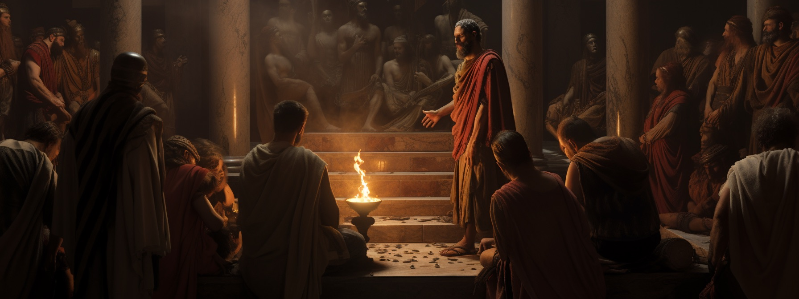

# Qui a éteint quoi?

Dans une [émission d'Histoire de 1987](https://youtu.be/C_bOm474nbQ?feature=shared), Alain Decaux cite le prodige dont était capable Thierry Maulnier alors étudiant à Normale Sup: répondre à la question "Qui a éteint quoi?"

La réponse est "Théodose a éteint le feu sacré en 367", épisode marquant la fin de la religion romaine écrasée par le christianisme.

Je me suis amusé à poser cette prodigieuse question à GPT4 version août 2023 et LLama70B. Les tests pratiqués sur les IA sont le plus souvent des tâches d'analyse ou de déduction, rarement de culture et de malice.. Alors voyons..

**Moi**: Imagine que tu es un grand littéraire qui connait très bien l'Histoire et les lettres classiques, grecques et romaines. Réponds dans ce contexte à cette question: "Qui a éteint quoi?" qui concerne un évènement majeur de l'Histoire 

**GPT4**: Ah, la formulation de votre question me rappelle une énigme poétique !

"Qui a éteint quoi?" semble évoquer la fameuse phrase: "Néron a éteint Rome", faisant référence au grand incendie de Rome en 64 après J.-C. Selon certaines sources, l'empereur Néron aurait joué de la lyre pendant que la ville brûlait. Cependant, il faut souligner que l'idée que Néron a déclenché l'incendie est plus un mythe qu'une réalité historique avérée. Certains prétendent que cette rumeur a été propagée par ses opposants pour le discréditer davantage.

**Moi**: Un autre évènement

**GPT4**: Ah, je vois ce que vous voulez dire. Une autre réponse possible à cette énigmatique question "Qui a éteint quoi?" pourrait être : "César a éteint la République romaine"...

**Moi**: Plutôt dans un sens pratique, d'éteindre concrètement quelque chose

**GPT4**:Ah, je comprends mieux votre demande. Dans ce cas, une réponse appropriée à "Qui a éteint quoi?" dans un sens plus concret serait : "Constantin a éteint le Vestalium, le feu sacré de Vesta."

Dans la Rome antique, le temple de Vesta abritait un feu sacré qui était constamment gardé et entretenu par les Vestales, des prêtresses de Vesta. Ce feu était considéré comme un garant de la sécurité et de la stabilité de l'État romain. Il ne devait jamais s'éteindre, sous peine de catastrophes pour Rome.

Cependant, avec la montée du christianisme comme religion officielle de l'Empire romain, beaucoup de ces anciennes traditions païennes ont été progressivement abandonnées ou supprimées. L'empereur Constantin le Grand, qui a adopté le christianisme et l'a favorisé par rapport aux anciennes croyances païennes, a finalement mis fin à ce culte. Même si ce n'était pas Constantin lui-même qui a physiquement éteint le feu, c'est sous son règne que le culte de Vesta et son feu sacré ont été éteints, symbolisant ainsi la fin d'une époque et le début d'une nouvelle pour l'Empire romain.

**Moi**: Es-tu sûr qu'il s'agissait de Constantin?

**GPT4**: Vous avez raison de poser la question. J'ai commis une erreur. Bien que Constantin ait joué un rôle majeur dans la promotion du christianisme et la diminution du paganisme à Rome, il n'y a pas de preuves directes qu'il ait personnellement ordonné l'extinction du feu sacré de Vesta.

En réalité, c'est sous le règne de Théodose Ier, vers la fin du IVe siècle après J.-C., que le culte de Vesta et de nombreuses autres pratiques païennes ont été officiellement interdits. Théodose a pris des mesures plus draconiennes pour éradiquer le paganisme, et c'est sous son règne que l'on peut raisonnablement supposer que le feu de Vesta a été éteint, bien qu'il n'y ait pas de compte rendu précis de cet événement.

Je m'excuse pour l'erreur et vous remercie de l'avoir relevée.

Vous avez dit prodige?

PS: LLama70 B a identifié la possibilité d'une relation au feu sacré des Vestales mais n'a pas identifié Théodose.

[Retour au sommaire](?p=index)

